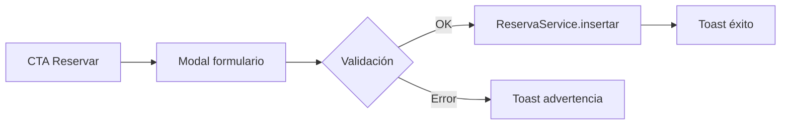

# Mockups — Horizonte Viajes

Prototipos de interfaz elaborados de forma **individual** para el proyecto final. Se trabajó en dos niveles de fidelidad: baja (estructura) y alta (diseño final implementado en HTML/CSS).

## Herramienta y enfoque

| Fase | Herramienta | Resultado |
|---|---|---|
| Baja fidelidad | Bocetos estructurales (Markdown + diagramas) | Definición de bloques por página |
| Alta fidelidad | HTML + Tailwind CSS | Páginas finales del repositorio |

> En contexto académico de Ingeniería de Software, el prototipo HTML/CSS cumple la función de **mockup interactivo de alta fidelidad**, alineado con las videoclases del curso.

## Página de inicio (`index.html`)

```
┌─────────────────────────────────────────────┐
│ Top bar · Navbar · [Reservar]               │
├─────────────────────────────────────────────┤
│ HERO CAROUSEL (3 slides + controles)        │
├─────────────────────────────────────────────┤
│ Quiénes somos │ imagen + servicios + stats  │
├─────────────────────────────────────────────┤
│ Destinos      │ galería + Top 5 ranking     │
├─────────────────────────────────────────────┤
│ Video experiencia │ reproductor HTML5          │
├─────────────────────────────────────────────┤
│ CTA band — Reservar ahora                   │
├─────────────────────────────────────────────┤
│ FOOTER                                      │
└─────────────────────────────────────────────┘
```

## Página de destinos (`pagina.html`)

```
┌─────────────────────────────────────────────┐
│ Header + breadcrumb                         │
├─────────────────────────────────────────────┤
│ Hero con métricas                           │
├─────────────────────────────────────────────┤
│ 3 tarjetas de paquetes + [Reservar]         │
├─────────────────────────────────────────────┤
│ Tabla de precios por temporada              │
├─────────────────────────────────────────────┤
│ Beneficios + CTA                            │
├─────────────────────────────────────────────┤
│ FOOTER                                      │
└─────────────────────────────────────────────┘
```

## Panel CRUD (`reservas.html`)

```
┌─────────────────────────────────────────────┐
│ Header admin ticker                         │
├─────────────────────────────────────────────┤
│ Hero “Solicitudes de viaje”                 │
├─────────────────────────────────────────────┤
│ Tabla: # · Cliente · Paquete · Fechas       │
│        [Modificar] [Eliminar]               │
├─────────────────────────────────────────────┤
│ Modal edición (mismo formulario de reserva) │
├─────────────────────────────────────────────┤
│ FOOTER                                      │
└─────────────────────────────────────────────┘
```

## Flujo del formulario de contacto



## Correspondencia mockup → implementación

| Mockup | Archivo final |
|---|---|
| Inicio | `index.html` |
| Destinos | `pagina.html` |
| Gestión CRUD | `reservas.html` |
| Formulario registro/edición | `js/reserva-modal.js` |
